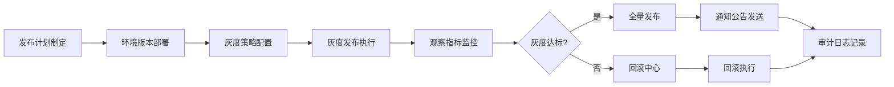

## 1. 产品概述

企业级发布管理平台，为多产品线的运营和研发团队提供统一的发布协调能力，涵盖灰度发布、通知公告、版本回滚和审计追踪全流程。

- 解决多产品线发布混乱、信息不对称、回滚不及时的问题
- 面向研发、运维、运营、客服等多角色协作，提升发布效率与可靠性

## 2. 核心功能

### 2.1 用户角色

| 角色 | 核心权限 |
|------|----------|
| 研发工程师 | 查看发布计划、提交灰度申请、执行回滚 |
| 运维工程师 | 环境管理、发布执行、策略配置 |
| 产品/运营 | 发布窗口管理、通知公告编辑 |
| 管理员 | 全功能权限、审计日志查看 |

### 2.2 功能模块

1. **发布驾驶舱**：全局视图，按产品线展示待发布版本、环境状态、上线窗口和负责人
2. **环境管理**：维护开发、测试、预发、正式四套环境的版本状态与变更备注
3. **灰度策略**：配置用户比例、地区、账号白名单及观察指标
4. **通知公告**：生成面向客服、销售、用户的发布说明，记录发送状态
5. **回滚中心**：回滚条件检查、操作确认、影响范围说明和结果登记
6. **审计日志**：按时间记录审批、变更、暂停、恢复和回滚动作

### 2.3 页面详情

| 页面名称 | 模块名称 | 功能描述 |
|----------|----------|----------|
| 发布驾驶舱 | 产品线概览卡片 | 展示各产品线当前版本、待发布版本、负责人 |
| 发布驾驶舱 | 上线时间线 | 按时间轴展示近期和计划中的发布 |
| 发布驾驶舱 | 环境状态概览 | 四套环境的健康度和版本同步状态 |
| 发布驾驶舱 | 统计指标卡 | 发布次数、成功率、平均耗时等关键指标 |
| 环境管理 | 环境列表 | 开发/测试/预发/正式四环境卡片 |
| 环境管理 | 版本状态详情 | 当前版本、部署时间、变更人、变更备注 |
| 环境管理 | 版本对比 | 环境间版本差异可视化对比 |
| 灰度策略 | 策略配置表单 | 用户比例、地区选择、白名单管理 |
| 灰度策略 | 观察指标面板 | 错误率、响应时间、用户反馈等指标 |
| 灰度策略 | 灰度进度 | 实时展示灰度推进进度和状态 |
| 通知公告 | 公告模板 | 客服/销售/用户三类发布说明模板 |
| 通知公告 | 编辑器 | 富文本编辑发布内容 |
| 通知公告 | 发送记录 | 发送对象、时间、状态追踪 |
| 回滚中心 | 回滚条件检查 | 前置条件校验清单 |
| 回滚中心 | 回滚确认 | 操作确认、影响范围说明、二次确认 |
| 回滚中心 | 回滚记录 | 历史回滚记录与结果登记 |
| 审计日志 | 时间线日志 | 审批/变更/暂停/恢复/回滚操作记录 |
| 审计日志 | 筛选过滤 | 按时间、操作类型、操作人员筛选 |
| 审计日志 | 操作详情 | 查看操作前后的详细变更内容 |

## 3. 核心流程

核心流程：研发团队制定发布计划后，依次在各环境部署版本，配置灰度策略并执行灰度发布。通过观察指标监控灰度效果，达标则全量发布并发送通知公告，不达标则进入回滚中心执行回滚。所有操作均记录到审计日志。

## 4. 用户界面设计

### 4.1 设计风格

- **主色调**：深空蓝 (#0F172A) 背景，搭配科技蓝 (#3B82F6) 作为主交互色
- **辅助色**：成功绿 (#10B981)、警告橙 (#F59E0B)、危险红 (#EF4444)、信息紫 (#8B5CF6)
- **设计语言**：深色科技风，玻璃拟态卡片，细腻的光效和微动效
- **按钮风格**：圆角 8px，悬停时轻微上浮并加光晕效果
- **字体**：Inter 为主字体，等宽字体展示版本号和技术参数
- **布局**：左侧导航 + 顶部状态栏 + 主内容区，卡片式信息聚合
- **图标**：Lucide 线性图标，保持简洁统一

### 4.2 页面设计概述

| 页面名称 | 模块名称 | UI 元素 |
|----------|----------|---------|
| 发布驾驶舱 | 概览区 | 大数字指标卡 + 渐变背景 + 趋势箭头 |
| 发布驾驶舱 | 产品线列表 | 卡片网格，悬浮动效，状态标签 |
| 发布驾驶舱 | 时间线 | 垂直时间轴，节点动画，状态色彩标识 |
| 环境管理 | 环境卡片 | 四列栅格，玻璃拟态，版本号高亮 |
| 环境管理 | 版本对比 | 差异对比条，颜色编码差异类型 |
| 灰度策略 | 配置表单 | 分段控件、滑块、标签输入框 |
| 灰度策略 | 指标面板 | 迷你图表、状态指示灯、脉冲动画 |
| 通知公告 | 模板选择 | 标签页切换，预览区实时刷新 |
| 通知公告 | 发送状态 | 进度条 + 状态图标 + 时间戳 |
| 回滚中心 | 检查清单 | 带勾选状态的列表项，逐项校验 |
| 回滚中心 | 确认区 | 醒目警告色，二次确认对话框 |
| 审计日志 | 时间线 | 左侧竖线 + 圆点节点 + 操作卡片 |
| 审计日志 | 筛选栏 | 下拉选择器 + 日期范围 + 搜索框 |

### 4.3 响应式

- 桌面端优先设计，1440px 为基准宽度
- 侧边栏在平板宽度可折叠为图标模式
- 卡片网格自适应列数，保持信息可读性
- 表格在移动端转为卡片列表展示

### 4.4 动效与交互

- 页面加载时卡片依次淡入上移（stagger animation）
- 状态变化时数字滚动计数动画
- 悬停卡片轻微上浮 + 阴影加深
- 进度条、灰度比例等使用平滑过渡
- 关键操作（回滚、发布）有确认弹窗和加载状态
