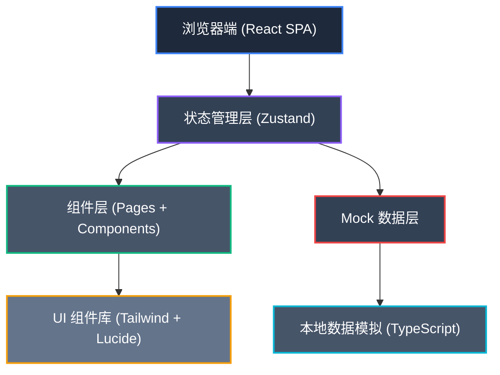

## 1. 架构设计



前端单页应用架构，采用 React 组件化开发，Zustand 管理全局状态，使用 Mock 数据模拟后端接口。

## 2. 技术描述

- **前端框架**：React 18 + TypeScript
- **构建工具**：Vite 5
- **样式方案**：Tailwind CSS 3
- **状态管理**：Zustand
- **路由管理**：React Router DOM 6
- **图标库**：Lucide React
- **数据方式**：Mock 数据（TypeScript 类型定义 + 模拟数据）
- **初始化工具**：vite-init

## 3. 路由定义

| 路由路径 | 页面名称 | 说明 |
|----------|----------|------|
| /dashboard | 发布驾驶舱 | 首页，全局概览视图 |
| /environments | 环境管理 | 四环境版本状态管理 |
| /canary | 灰度策略 | 灰度规则配置与监控 |
| /notices | 通知公告 | 发布说明编辑与发送 |
| /rollback | 回滚中心 | 回滚操作与历史记录 |
| /audit | 审计日志 | 操作审计与追踪 |

## 4. 数据模型

### 4.1 核心数据类型

```typescript
// 产品线
interface ProductLine {
  id: string;
  name: string;
  code: string;
  currentVersion: string;
  pendingVersion: string;
  owner: string;
  status: 'normal' | 'deploying' | 'warning';
  launchWindow: string;
}

// 环境
interface Environment {
  id: string;
  name: string;
  type: 'dev' | 'test' | 'staging' | 'prod';
  version: string;
  deployTime: string;
  deployer: string;
  changeNotes: string;
  health: number;
  status: 'running' | 'updating' | 'error';
}

// 灰度策略
interface CanaryStrategy {
  id: string;
  productLineId: string;
  userPercent: number;
  regions: string[];
  whitelist: string[];
  metrics: CanaryMetric[];
  status: 'draft' | 'running' | 'paused' | 'completed';
  startTime: string;
}

// 灰度指标
interface CanaryMetric {
  name: string;
  value: number;
  threshold: number;
  unit: string;
  trend: 'up' | 'down' | 'stable';
  status: 'normal' | 'warning' | 'error';
}

// 通知公告
interface Notice {
  id: string;
  title: string;
  content: string;
  type: 'customer_service' | 'sales' | 'user';
  status: 'draft' | 'sent' | 'scheduled';
  sendTime: string;
  sender: string;
  targetCount: number;
  sentCount: number;
}

// 回滚记录
interface RollbackRecord {
  id: string;
  productLineId: string;
  environment: string;
  fromVersion: string;
  toVersion: string;
  reason: string;
  operator: string;
  time: string;
  status: 'success' | 'failed' | 'in_progress';
  impactScope: string;
}

// 审计日志
interface AuditLog {
  id: string;
  action: 'approve' | 'change' | 'pause' | 'resume' | 'rollback' | 'deploy';
  operator: string;
  target: string;
  time: string;
  detail: string;
  before: Record<string, unknown>;
  after: Record<string, unknown>;
}
```

### 4.2 状态管理

使用 Zustand 创建全局 store：

```typescript
interface AppState {
  productLines: ProductLine[];
  environments: Environment[];
  canaryStrategies: CanaryStrategy[];
  notices: Notice[];
  rollbackRecords: RollbackRecord[];
  auditLogs: AuditLog[];
  selectedProductLine: string | null;
}
```

## 5. 项目结构

```
src/
├── components/          # 公共组件
│   ├── Layout/         # 布局组件
│   ├── Card/           # 卡片组件
│   ├── StatusBadge/    # 状态标签
│   └── Timeline/       # 时间线组件
├── pages/              # 页面组件
│   ├── Dashboard/      # 发布驾驶舱
│   ├── Environments/   # 环境管理
│   ├── Canary/         # 灰度策略
│   ├── Notices/        # 通知公告
│   ├── Rollback/       # 回滚中心
│   └── Audit/          # 审计日志
├── store/              # 状态管理
│   └── useStore.ts
├── data/               # Mock 数据
│   └── mockData.ts
├── types/              # 类型定义
│   └── index.ts
├── App.tsx
├── main.tsx
└── index.css
```

## 6. 开发规范

- 组件使用函数式组件 + TypeScript
- 每个文件不超过 300 行，复杂组件拆分
- 使用 Tailwind CSS 原子化样式
- 状态变更通过 store 统一管理
- 图标使用 Lucide React 组件
- 页面切换使用 React Router
